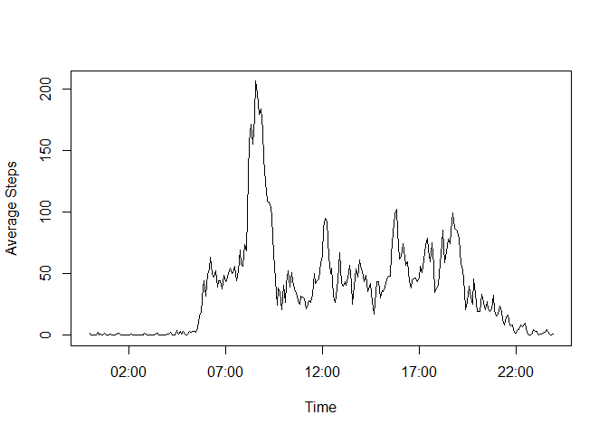
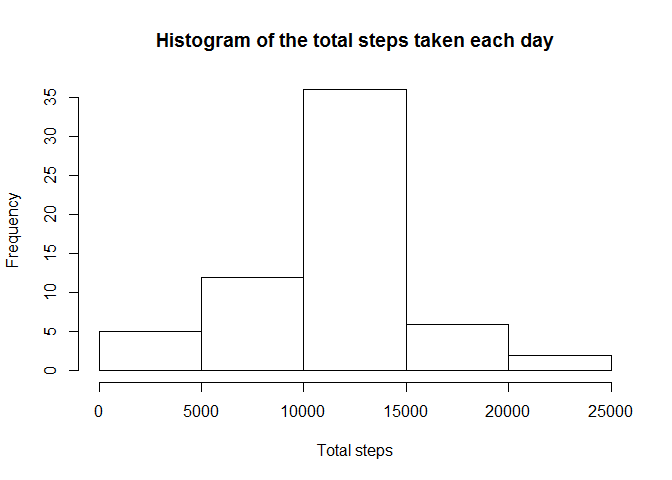

# Reproducible Research: Peer Assessment 1


## Loading and preprocessing the data
Please ensure that activity.zip file is available in the current working directory. Unzip the data file and load the data into activity data frame

```r
if(!file.exists(activityFile)){
        unzip(zipFile)
}
activity <- read.csv(activityFile)
```


## What is mean total number of steps taken per day?
#### 1. Make a histogram of the total number of steps taken each day
Summarise the activity data to group by date ignoring the missing values. This summarised data is used to plot the histogram of the total number of steps taken each day.

```r
activityByDay <- summarise(group_by(activity, date), totalSteps = sum(steps, na.rm = TRUE))
hist(activityByDay$totalSteps, main = "Histogram of the total steps taken each day", xlab = "Total steps")
```

 

Note that barplot should not be used here. Please refer to forums for more details: 
https://class.coursera.org/repdata-016/forum/thread?thread_id=3

#### 2. Calculate and report the mean and median total number of steps taken per day

```r
mean(activityByDay$totalSteps)
```

```
## [1] 9354
```

```r
median(activityByDay$totalSteps)
```

```
## [1] 10395
```


## What is the average daily activity pattern?
#### 1. Make a time series plot (i.e. type = "l") of the 5-minute interval (x-axis) and the average number of steps taken, averaged across all days (y-axis)

Summarise the activity data to group by interval ignoring the missing values. Add a new column to indicate time using a dummy date. This summarised data is used to plot the time series graph.

```r
activityByInterval <- summarise(group_by(activity, interval), avgSteps = mean(steps, na.rm = TRUE))
activityByInterval$time <- seq(ISOdate(2000,1,1,0,0,0), by="5 min", length.out = length(activityByInterval$interval))

plot(x = activityByInterval$time, y = activityByInterval$avgSteps, type = "l", xlab = "Time", ylab ="Average Steps")
```

 

#### 2. Which 5-minute interval, on average across all the days in the dataset, contains the maximum number of steps?

```r
activityByInterval[which.max(activityByInterval$avgSteps), 1:2]
```

```
## Source: local data frame [1 x 2]
## 
##   interval avgSteps
## 1      835    206.2
```
The above 5-minute interval contains the maximum number of steps on average across all the days.


## Imputing missing values
#### 1. Calculate and report the total number of missing values in the dataset (i.e. the total number of rows with NAs).

```r
sum(!complete.cases(activity))
```

```
## [1] 2304
```
The above number indicates the total number of rows with missing values in the dataset.

#### 2. Devise a strategy for filling in all of the missing values in the dataset. The strategy does not need to be sophisticated. For example, you could use the mean/median for that day, or the mean for that 5-minute interval, etc
The strategy used by me for filling the missing values is to use the mean for that 5-minute interval assuming that the pattern in activity remains more or less same.

#### 3. Create a new dataset that is equal to the original dataset but with the missing data filled in.
Based on the strategy selected, the activity dataset is merged with the activityByInterval and wherever Steps data is missing, it is filled up by corresponding mean value of the steps for the given interval.

```r
activityNew <- merge(activity, select(activityByInterval, interval, avgSteps), by="interval")
activityNew$steps[is.na(activityNew$steps)] <- activityNew$avgSteps[is.na(activityNew$steps)]
```

#### 4. Make a histogram of the total number of steps taken each day and Calculate and report the mean and median total number of steps taken per day. Do these values differ from the estimates from the first part of the assignment? What is the impact of imputing missing data on the estimates of the total daily number of steps?

```r
activityNewByDay <- summarise(group_by(activityNew, date), totalSteps = sum(steps))
hist(activityNewByDay$totalSteps, main = "Histogram of the total steps taken each day", xlab = "Total steps")
```

 

```r
mean(activityNewByDay$totalSteps)
```

```
## [1] 10766
```

```r
median(activityNewByDay$totalSteps)
```

```
## [1] 10766
```
The values differ from the estimates from the first part of assignment and both mean and median has increased. The histogram of total number of steps taken each day has also become more normal.


## Are there differences in activity patterns between weekdays and weekends?
#### 1. Create a new factor variable in the dataset with two levels - "weekday" and "weekend" indicating whether a given date is a weekday or weekend day.

```r
activityNew <- mutate(activityNew, daytype = as.factor(ifelse(weekdays(as.Date(date)) %in% c("Saturday","Sunday"),"weekend","weekday")))
```

#### 2. Make a panel plot containing a time series plot (i.e. type = "l") of the 5-minute interval (x-axis) and the average number of steps taken, averaged across all weekday days or weekend days (y-axis). See the README file in the GitHub repository to see an example of what this plot should look like using simulated data.
Summarise the data based on the newly created factor variable to indicate day type and interval. Plot the graph to show average number of steps taken for weekdays and weekends.

```r
activityDay <- summarise(group_by(activityNew, daytype, interval), avgSteps = mean(steps))

g <- ggplot(activityDay, aes(interval, avgSteps)) + geom_line(size = 1) +
        facet_wrap(~ daytype, nrow = 2, ncol = 1) +
        labs(x = "Interval") + labs(y = "Average steps")
        
print(g)
```

 
